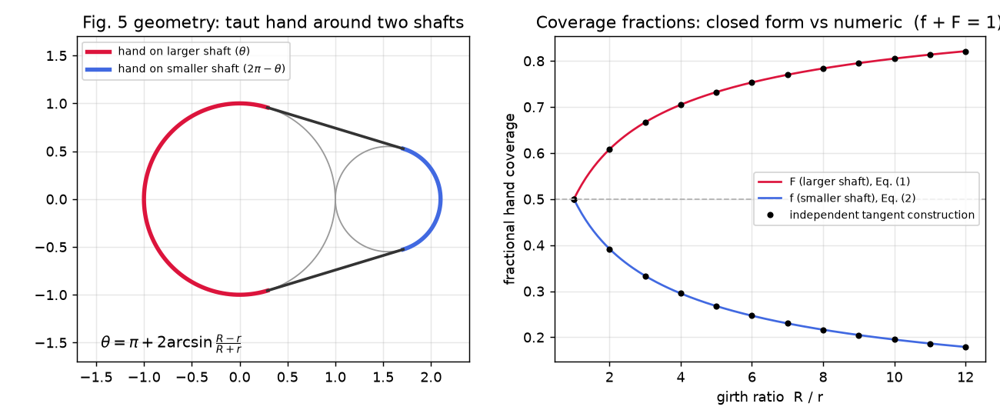
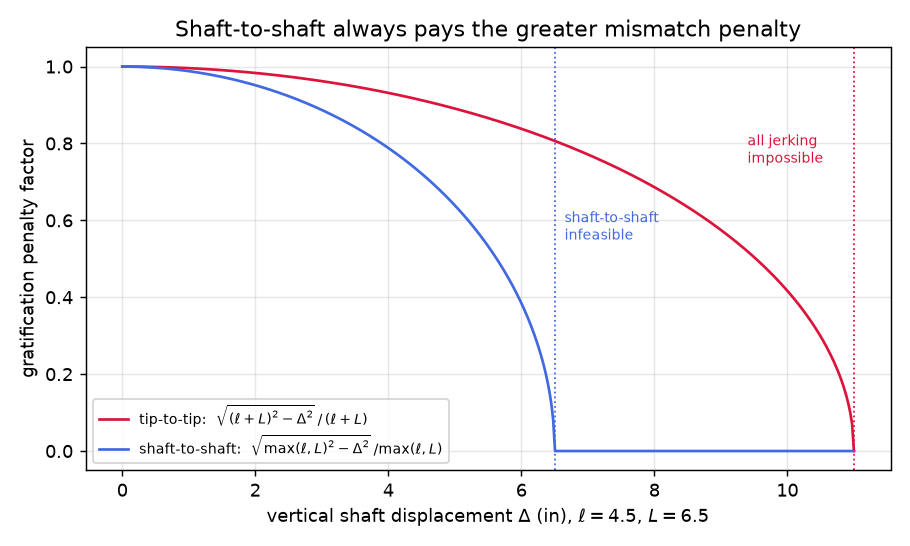
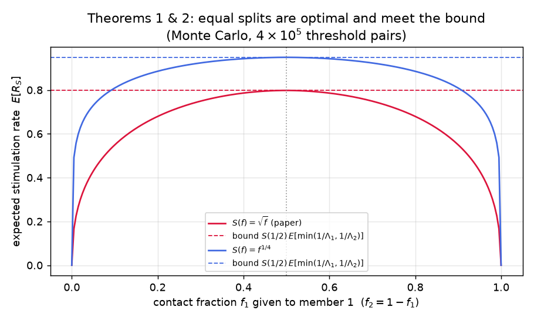
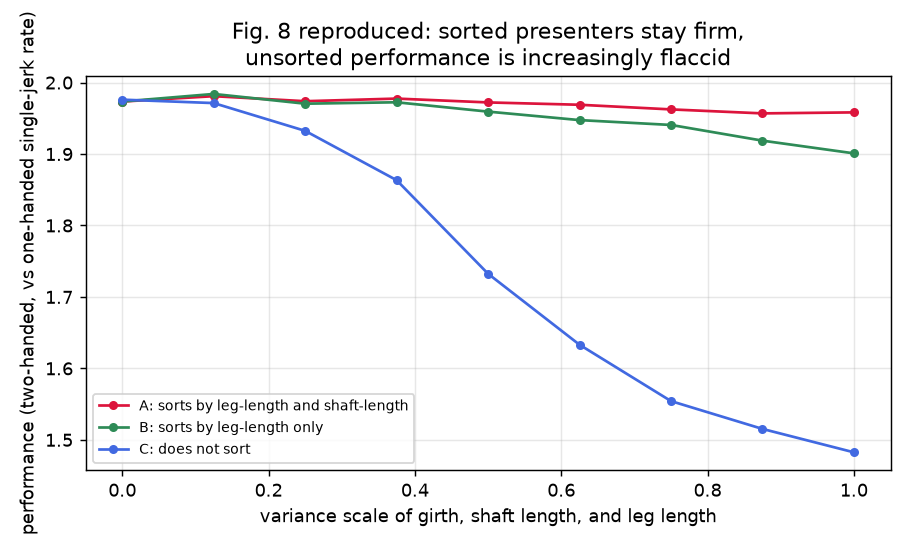
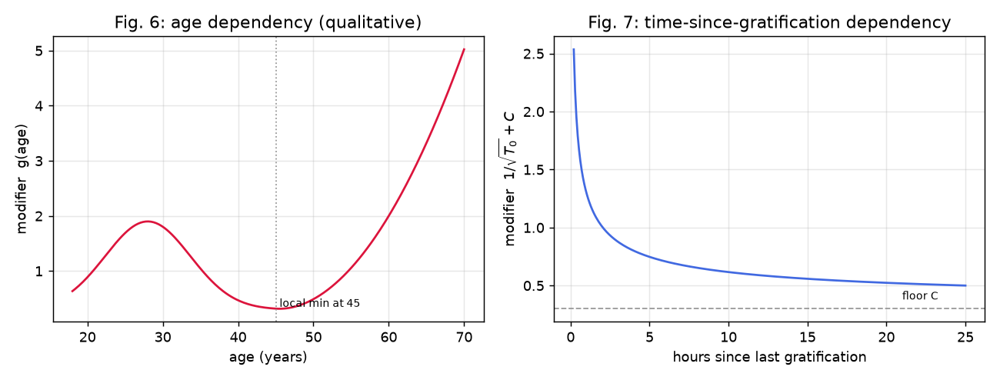

# Optimal Tip-to-Tip Efficiency: An Independent Verification

An independent numerical verification of Chugtai & Gilfoyle (2014),
**"Optimal Tip-to-Tip Efficiency: a model for male audience stimulation"**
([paper PDF](https://www.scribd.com/doc/228831637/Optimal-Tip-to-Tip-Efficiency)).

The paper introduces a probabilistic model for the stimulation of a large male
audience, derives the contact geometry of double jerking in both tip-to-tip and
shaft-to-shaft configurations, and proves two optimality theorems for member
pre-sorting. Despite the work's evident influence, no independent replication
of its results has appeared in the literature. This repository addresses that
gap. Every closed-form result is verified by an **independent numerical
construction** (never by re-evaluating the paper's own formula), both theorems
are confirmed by Monte Carlo, and all figures are reproduced.

**We confirm the paper's central findings** across a suite of 27 tests, and
report one normalization inconsistency in Figure 8 (see
[What doesn't reproduce](#what-doesnt-reproduce)).

## Scorecard

| Paper claim | Where | Verdict |
|---|---|---|
| Taut-hand contact angle θ = π + 2 arcsin((R−r)/(R+r)) | Sec. 1.2.1 | Verified — matches independent tangent-line construction to 1e-10 |
| Coverage fractions satisfy f + F = 1 (Eqs. 1–2) | Sec. 1.2.1 | Verified — exact, both shafts' arcs measured numerically |
| Concavity makes double jerking beneficial: 2S(½) > S(1) | Sec. 1.2.1 | Verified — for √f and every concave S tried (equality only as S → linear) |
| Shaft-to-shaft pays a strictly greater leg-mismatch penalty | Sec. 1.2 | Verified — for all displacements Δ; also infeasible sooner (Δ > max(ℓ,L) vs Δ > ℓ+L) |
| Theorem 1: equal girth split f₁ = ½ maximizes E[R_S], meeting the bound S(½)·E[min(1/Λ₁, 1/Λ₂)] | Sec. 3 | Verified — Monte Carlo, 4×10⁵ threshold pairs, three concave S functions |
| Theorem 2: same for temporal split (tip-to-tip) | Sec. 3 | Verified — identical mathematics to Theorem 1 |
| The i.i.d. assumption in the proofs is load-bearing | Sec. 3 | Verified — with mismatched Λ distributions the optimum moves off ½ |
| Fig. 8: sorted presenters stay strong, unsorted "increasingly flaccid" | Sec. 4 | Verified — ordinal claims reproduce (A ≥ B ≥ C, A flat, C decaying) |
| Fig. 8's absolute performance level (~2.0) | Sec. 4 | Discrepancy — only consistent with a two-hands-vs-one-hand normalization — see below |

## Figures

### Contact geometry (paper Fig. 5, Eqs. 1–2)
The hand is modeled as a taut band around two externally tangent circles. The
paper's closed form for the contact angle is checked against a root-finding
construction of the common external tangent lines that never touches the formula.



### Leg-length mismatch penalties (Sec. 1.2, Figs. 3–4)
Tip-to-tip bridges a height difference with the *sum* of shaft lengths,
shaft-to-shaft only with the *longer* shaft — so shaft-to-shaft always pays more
and fails earlier. This is the paper's core argument for pre-sorting by leg length.



### Theorems 1 & 2 (Sec. 3)
The expected stimulation rate over all splits of hand contact between two members,
under the paper's own threshold model (Eq. 3). The maximum sits exactly at the
equal split and exactly meets the theorem's bound.



### Figure 8 reproduction (Sec. 4)
Three presenters tip-to-tip double jerk the same audience (girth, shaft length,
and leg length as truncated normals centered on 2.0″, 5.5″, and 31″). Presenter A
sorts by leg-length then shaft-length, B by leg-length only, C not at all.



### Threshold model (paper Figs. 6–7)
The gratification threshold Λ = Z + g(age)·(1/√T₀ + C). The age curve is a
qualitative stand-in with the paper's stated critical points (local max near 28,
local min at 45, monotone increase after); the paper gives no closed form.



## What doesn't reproduce

The paper's Fig. 8 shows performance ≈ **2.0** at zero variance, normalized "by
expected single-jerking performance." But under the paper's own model this is
impossible per hand: a tip-to-tip pair splits jerk time equally at best, so each
member receives T(½) = √½ per jerk, a pair completes in max(Λ₁, Λ₂)/√½ jerks
versus Λ₁ + Λ₂ singly, and the speedup is hard-capped at

**2·T(½) = √2 ≈ 1.414 < 2**

with threshold heterogeneity only pulling it lower (the pair is held hostage by
its needier member — `tests/test_simulation.py` proves both directions). The
paper's ~2.0 is therefore only consistent with comparing a **two-handed** double
jerker against a **one-handed** single-jerk baseline. We adopt that normalization
for the reproduction, noting it is compatible with the paper's own observation
that "the presenter almost certainly has two hands" (Sec. 1.1).

Also not exactly reproducible (unspecified in the paper): the variance units of
Fig. 8's x-axis, the age/T₀ distributions feeding Eq. 3, and the handling of
pairs whose shafts cannot bridge the leg-length gap (we fall back to single
jerks). The scorecard's ordinal claims are insensitive to these choices.

## Run it

```bash
uv venv && uv pip install numpy scipy matplotlib pytest   # or pip install
.venv/bin/python -m pytest -v                             # verify the paper
.venv/bin/python scripts/make_figures.py                  # regenerate figures/
```

## Layout

- [`tiptotip/geometry.py`](tiptotip/geometry.py) — contact-angle formula + independent tangent construction, mismatch penalties
- [`tiptotip/gratification.py`](tiptotip/gratification.py) — S(f) = √f, threshold model Λ (Eq. 3, Figs. 6–7)
- [`tiptotip/simulate.py`](tiptotip/simulate.py) — presenters A/B/C, Fig. 8 sweep
- [`tests/`](tests) — the verification suite
- [`scripts/make_figures.py`](scripts/make_figures.py) — regenerates every figure above

## Reference

D. Chugtai and B. Gilfoyle, "Optimal Tip-to-Tip Efficiency: a model for male
audience stimulation," unpublished manuscript, May 29, 2014. The paper is ©
its authors and is linked rather than redistributed here. The original authors
"graciously thank Vinith Misra for doing pretty much everything."

```bibtex
@unpublished{chugtai2014tiptotip,
  author = {Chugtai, Dinesh and Gilfoyle, Bertram},
  title  = {Optimal Tip-to-Tip Efficiency: a model for male audience stimulation},
  year   = {2014},
  month  = {5},
  note   = {Unpublished manuscript}
}
```
